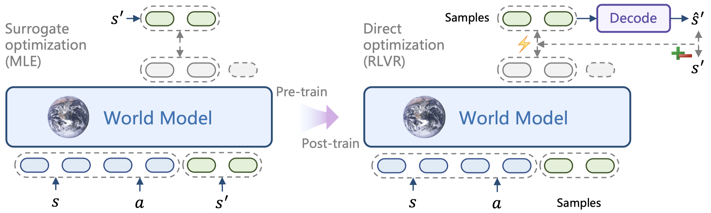

# RLVR-World: Training World Models with Reinforcement Learning

[](https://thuml.github.io/RLVR-World/)
[](https://arxiv.org/abs/2505.13934)
[](https://huggingface.co/collections/thuml/rlvr-world-682f331c75a904b8febc366a)

This is the official code base for the paper [RLVR-World: Training World Models with Reinforcement Learning](https://arxiv.org/abs/2505.13934).

## 🔥 News

- 🚩 **2025.05.26**: We release all models and datasets.
- 🚩 **2025.05.21**: We open-source our training codes.
- 🚩 **2025.05.21**: Our paper is released on [arXiv](https://arxiv.org/abs/2505.13934).

## 📋 TL;DR

We pioneer training world models through RLVR:

- World models across various modalities (particularly, language and videos) are unified under a sequence modeling formulation;
- Task-specific prediction metrics serve as verifiable rewards directly optimized by RL.



## 🤗 Models and Datasets

At the moment we provide the following models and datasets:

| Modality | Type        | Domain             | Name                                                         |
| -------- | ----------- | ------------------ | ------------------------------------------------------------ |
| Language | Dataset     | Text game          | [bytesized32-world-model-cot](https://huggingface.co/datasets/thuml/bytesized32-world-model-cot) |
| Language | World model | Text game          | [bytesized32-world-model-sft](https://huggingface.co/thuml/bytesized32-world-model-sft) |
| Language | World model | Text game          | [bytesized32-world-model-rlvr-binary-reward](https://huggingface.co/thuml/bytesized32-world-model-rlvr-binary-reward) |
| Language | World model | Text game          | [bytesized32-world-model-rlvr-task-specific-reward](https://huggingface.co/thuml/bytesized32-world-model-rlvr-task-specific-reward) |
| Language | Dataset     | Web navigation     | [webarena-world-model-cot](https://huggingface.co/datasets/thuml/webarena-world-model-cot) |
| Language | World model | Web navigation     | [webarena-world-model-sft](https://huggingface.co/thuml/webarena-world-model-sft) |
| Language | World model | Web navigation     | [webarena-world-model-rlvr](https://huggingface.co/thuml/webarena-world-model-rlvr) |
| Video    | Tokenizer   | Robot manipulation | [rt1-frame-tokenizer](https://huggingface.co/thuml/rt1-frame-tokenizer) |
| Video    | World model | Robot manipulation | [rt1-world-model-single-step-base](https://huggingface.co/thuml/rt1-world-model-single-step-base) |
| Video    | World model | Robot manipulation | [rt1-world-model-single-step-rlvr](https://huggingface.co/thuml/rt1-world-model-single-step-rlvr) |
| Video    | Tokenizer   | Robot manipulation | [rt1-compressive-tokenizer](https://huggingface.co/thuml/rt1-compressive-tokenizer) |
| Video    | World model | Robot manipulation | [rt1-world-model-multi-step-base](https://huggingface.co/thuml/rt1-world-model-multi-step-base) |
| Video    | World model | Robot manipulation | [rt1-world-model-multi-step-rlvr](https://huggingface.co/thuml/rt1-world-model-multi-step-rlvr) |

## 💬 Evaluating Language World Models

See [`lang_wm`](/lang_wm):

- Text game state prediction
- Web page state prediction
- Application: Model predictive control for web agents

## 🎇 Evaluating Video World Models

See [`vid_wm`](/vid_wm):

- Robot manipulation trajectory prediction
- Application: Real2Sim policy evaluation

## 🎥 Showcases


## 🚀 Release Progress

- [x] Video world model with RLVR
- [x] Pre-trained & post-trained video world model weights
- [x] Real2sim policy evaluation with video world model
- [x] Text game SFT data
- [x] Web page SFT data
- [x] Language world model on text games with RLVR
- [x] Language world model on web pages with RLVR
- [x] Pre-trained & post-trained language world model weights
- [x] Web agents with language world model

## 📜 Citation

If you find this project useful, please cite our paper as:

```
@article{wu2025rlvr,
    title={RLVR-World: Training World Models with Reinforcement Learning}, 
    author={Jialong Wu and Shaofeng Yin and Ningya Feng and Mingsheng Long},
    journal={arXiv preprint arXiv:2505.13934},
    year={2025},
}
```

## 🤝 Contact

If you have any question, please contact wujialong0229@gmail.com.

## 💡 Acknowledgement

We sincerely appreciate the following github repos for their valuable codebase we build upon:

- https://github.com/volcengine/verl
- https://github.com/thuml/iVideoGPT
- https://github.com/kyle8581/WMA-Agents
- https://github.com/cognitiveailab/GPT-simulator
- https://github.com/web-arena-x/webarena
- https://github.com/simpler-env/SimplerEnv
