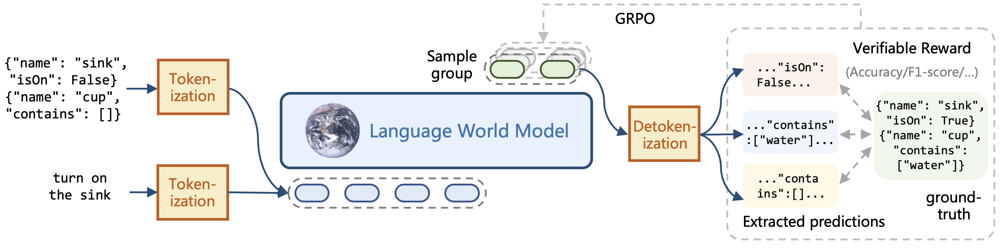

# Language World Models with RLVR

## Method Overview



## Installation

```bash
# Python 3.10 or 3.11 recommended
conda create -n verl python=3.10
cd verl
pip install -e .
```

## Data Preparation

### Text Game

All data has been uploaded to [Hugging Face](https://huggingface.co/datasets/thuml/bytesized32-world-model-cot).

You can either download them directly or generate them yourself by following the ``README.md`` in ``data_process/text_game``.

###  Web Page

All data has been uploaded to [Hugging Face](https://huggingface.co/datasets/thuml/webarena-world-model-cot).

## Supervised Fine-Tuning (SFT)

### Text Game

```bash
bash verl/examples/sft/text_game_simulator/run_text_game_simulator_sft.sh
```

### Web Page

```bash
bash verl/examples/sft/web_agent/run_web_agent_sft.sh
```

After training, the model will be saved in `default_local_dir` specified in the script.

To merge the LoRA weights into the base model, run the following command:

```bash
python verl/merge_lora.py
```

You have to specify the directory for LoRA weights in the script.

## Post-training with RLVR

### Text Game Simulator

Run the following command. This command uses binary reward by default. If you want to use the task-specific reward described in the paper, simply modify the two parameters ``data.sample_no_gold_data_num`` and ``reward_model.text_game_reward_type`` as indicated in the comments.

```bash
bash examples/grpo_trainer/run_text_game_simulator_rl.sh \
    data.train_files=train_state_difference_gold_data.parquet \
    data.val_files=test_state_difference.parquet \
    actor_rollout_ref.model.path=thuml/bytesized32-world-model-base \
    trainer.default_local_dir=log/rlvr_text_game_simulator_experiment \
    trainer.project_name=verl_grpo_text_game_simulator \
    trainer.experiment_name=grpo_text_game_simulator_binary_reward \
    +data.sample_no_gold_data_num=7278 \   # 1000 for task-specific reward
    +data.sample_no_gold_data_file=train_state_difference_no_gold_data.parquet \
    +reward_model.text_game_reward_type=binary  # =task_specific for task-specific reward
```

### Web Page

```bash
bash examples/grpo_trainer/run_web_agnet_rl.sh
```

The trained model will be saved in `default_local_dir` specified in the script.

To merge weights, run the following command:

```bash
python verl/scripts/model_merger.py --local_dir log/xxxx/checkpoints/global_step_xxxx/actor --output_dir <output_dir> --backend fsdp --hf_model_path deepseek-ai/DeepSeek-R1-Distill-Qwen-1.5B 
```

## Downstream Task: Model Predictive Control for Web Agents

Code and instruction can be found in ``webagent/``

## Acknowledgements

Our `verl` codebase is forked from commit [`fbad52`](https://github.com/volcengine/verl/tree/fbad52e1204c84f277b4e94f2f236b51b0ebaff4) of official repo.
