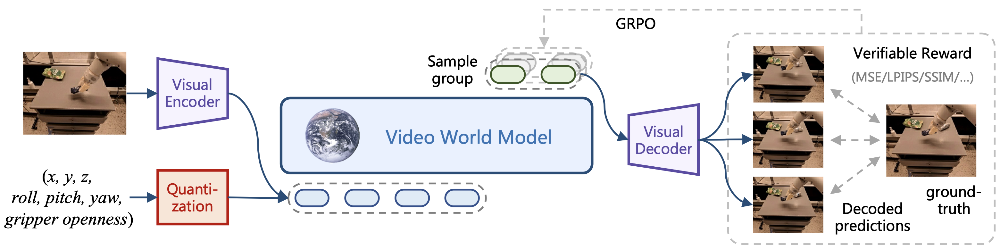

# Video World Models with RLVR

## Method Overview



## Installation

```bash
conda create -n vid_wm python==3.10
conda activate vid_wm
cd verl
pip install -e ".[vllm,gpu]"
cd ..
pip install -r requirements.txt
```

## Data Preparation

Download the RT1 dataset from [Open X-Embodiment](https://github.com/google-deepmind/open_x_embodiment) and extract single episodes as `.npz` files:

```bash
python oxe_data_converter.py --dataset_name fractal20220817_data --input_path {path to downloaded OXE} --output_path {path to stored npz}
```

## Pre-training

Single-step prediction:

```bash
cd ivideogpt
bash scripts/train_perframe_tokenizer.sh --dataset_path {path to preprocessed data}
```

```bash
cd ivideogpt
bash scripts/train_single_step_prediction.sh --dataset_path {path to preprocessed data}
```

Multi-step prediction:

```bash
cd ivideogpt
bash scripts/train_compressive_tokenizer.sh --dataset_path {path to preprocessed data}
```

```bash
cd ivideogpt
bash scripts/train_multi_step_prediction.sh --dataset_path {path to preprocessed data}
```

## Post-training with RLVR

Single-step prediction:

```bash
cd verl
bash examples/grpo_trainer/run_vgpt.sh \
    trainer.experiment_name='vgpt'\
    processor.processor_type=simple \
    data.video.dataset_path={path to preprocessed data} \
    processor.tokenizer.path={path to pretrained perframe tokenizer} \
    actor_rollout_ref.model.path={path to pretrained single-step pred transformer} \
    data.max_response_length=321 \
    trainer.val_before_train=True trainer.test_freq=10 trainer.save_freq=10 \
    actor_rollout_ref.rollout.n=16
```

Multi-step prediction:

```bash
cd verl
bash examples/grpo_trainer/run_ctx_msp_vgpt.sh \
    trainer.experiment_name='ctx_vgpt_msp8' \
    trainer.reward_fn=mae \
    data.video.dataset_path={path to preprocessed data} \
    processor.tokenizer.path={path to pretrained compressive tokenizer} \
    actor_rollout_ref.model.path={path to pretrained multi-step pred transformer} \
    trainer.val_before_train=True trainer.test_freq=10 trainer.save_freq=10 \
    actor_rollout_ref.rollout.n=16
```

## Video Prediction Evaluation

```bash
cd ivideogpt
bash scripts/eval_single_step_prediction.sh --dataset_path {path to preprocessed data}
bash scripts/eval_multi_step_prediction.sh --dataset_path {path to preprocessed data}
```

## Downstream Task: Real2Sim Policy Evaluation

Follow the instructions in [simpler-env](https://github.com/simpler-env/SimplerEnv?tab=readme-ov-file#rt-1-inference-setup) to download RT-1 checkpoints.

```bash
cd ivideogpt
bash scripts/eval_policy.sh \
    --task_instruction "open middle drawer" \
    --policy_model_path pretrained_models/rt_1_tf_trained_for_000400120 \
    --dataset_path {path to preprocessed data}
```

## Tips

- If you encouter `ImportError: cannot import name 'cached_download' from 'huggingface_hub' (/workspace/wujialong/anaconda3/envs/vid_wm5/lib/python3.10/site-packages/huggingface_hub/__init__.py)` due to version incompatibility, just remove import of `cached_download`.

## Acknowledgement

Our `verl` directory is forked from commit [`15263cb`](https://github.com/volcengine/verl/tree/15263cb86a464264edb1e5462675e25ddf6ff9d8) of official repo.